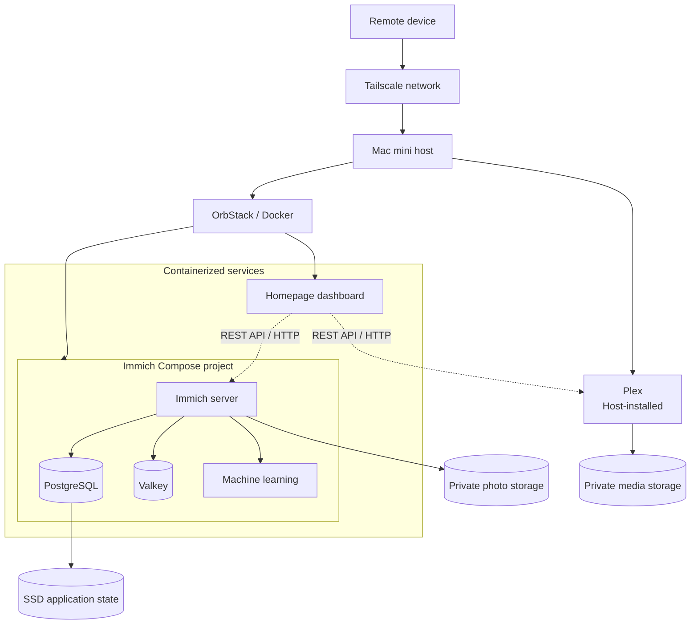

# Homelab Infrastructure

A sanitized view of the self-hosted environment I configured and operate on a
Mac mini to learn containerization, networking, remote connectivity, service
integration, APIs, persistent storage, and day-to-day operations.

The public repository focuses on Immich, a lightweight Homepage dashboard,
host-installed Plex, and Tailscale remote access. It intentionally excludes
credentials, personal data, runtime state, and private services outside this
portfolio's scope.

## Why I Built It

I wanted practical experience operating services that depend on each other,
rather than studying containers and networking only in isolation. This lab
provided a place to configure deployments, diagnose failures, validate storage
behavior, and understand how host and container networking interact.

I designed, configured, integrated, and operate this environment. I used Codex
and Gemini to assist with portions of the configuration and helper scripts,
then tested, debugged, and adapted the outputs against the live deployment.

## Architecture



Tailscale runs directly on macOS and is the remote-access mechanism I use away
from the local network. Containers run through OrbStack and Docker Compose;
Plex runs directly on the host. This repository does not claim to verify router
port-forwarding or host firewall policy.

## Technologies

| Area | Technology |
| --- | --- |
| Host and containers | macOS, OrbStack, Docker, Docker Compose |
| Photo services | Immich, PostgreSQL, Valkey, Immich machine learning |
| Host application | Plex |
| Dashboard and APIs | Homepage, REST/HTTP, Bash |
| Remote access | Tailscale |

These are third-party applications and platforms. My work is the environment
design, deployment configuration, integration, testing, troubleshooting, and
ongoing operation—not development of the applications themselves.

## Containerization and Persistence

Immich runs as a four-service Compose project. The application server depends
on PostgreSQL and Valkey, while a separate machine-learning container maintains
its own model cache. Only the Immich application port is published by the
template; database and cache ports remain inside the Compose project network.

Application state is separated from bulk photo and media storage. Public
examples use environment variables and ignored `runtime/` directories instead
of real host paths. See [storage and persistence](docs/storage-and-persistence.md).

## Networking and Remote Access

Tailscale provides authenticated remote access to services on the Mac mini.
Homepage uses HTTP APIs to display selected Immich and Plex information. Plex
is documented only as a host-level architectural component; its database,
metadata, logs, library contents, and token remain private.

See [architecture](docs/architecture.md) and
[remote access](docs/remote-access.md) for the trust boundaries and limitations
of what can be verified from configuration files.

## Operational Tooling

The repository includes generalized helpers for:

- validating Compose files and checking container state;
- checking Immich, Homepage, and optional Plex HTTP reachability;
- verifying expected storage paths;
- creating an Immich PostgreSQL logical dump;
- archiving public configuration with manifests and checksums; and
- applying retention and restrictive backup permissions.

The backup helper does not copy photo or media libraries. Review
[operations](docs/operations.md) before using it.

## Setup

1. Install Docker with Docker Compose. This deployment uses OrbStack on macOS.
2. Copy each example environment file and replace its placeholders:

   ```bash
   cp compose/immich/.env.example compose/immich/.env
   cp compose/homepage/.env.example compose/homepage/.env
   cp .env.example .env
   ```

3. Create the ignored runtime directories:

   ```bash
   mkdir -p runtime/immich/library runtime/immich/postgres
   mkdir -p runtime/homepage/host-stats backups
   ```

4. Validate and start each project:

   ```bash
   docker compose -f compose/immich/compose.yaml config
   docker compose -f compose/homepage/compose.yaml config
   docker compose -f compose/immich/compose.yaml up -d
   docker compose -f compose/homepage/compose.yaml up -d
   ```

5. Run `./ops/status.sh` and configure the optional storage-stat helper.

## Security and Privacy

The repository excludes populated environment files, API credentials, real
hostnames and addresses, application databases, photos, media, logs, caches,
certificates, keys, backups, and dashboard artwork. Example credentials are
blank. Host bindings are configurable and should be reviewed for the target
network; Tailscale usage alone does not prove that other access paths are
blocked. See [security and privacy](docs/security-and-privacy.md).

## What I Learned

- How Compose models service dependencies and project networks.
- How PostgreSQL, Valkey, and machine-learning services support Immich.
- How bind mounts and named volumes affect persistence and recovery.
- How host-installed and containerized applications can share API-driven views.
- How remote connectivity, permissions, storage, and service health interact.
- How to turn troubleshooting steps into repeatable status and backup tooling.

Additional operational notes are in [troubleshooting](docs/troubleshooting.md).
